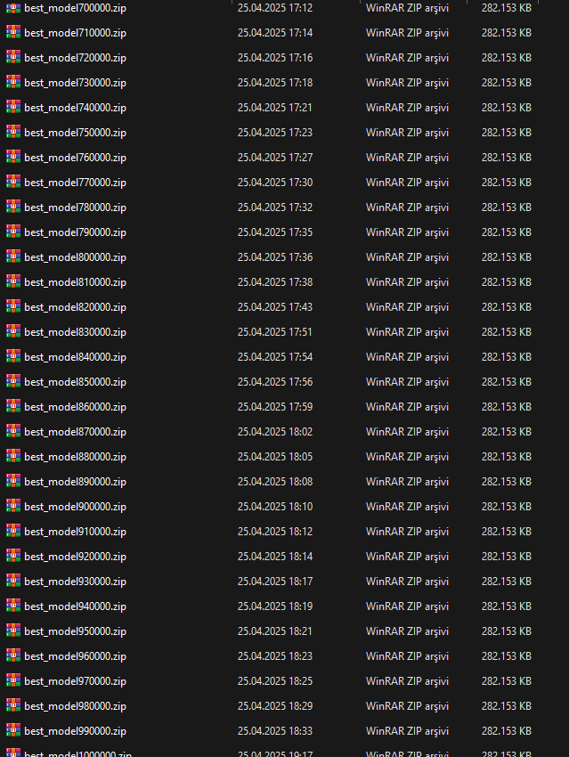
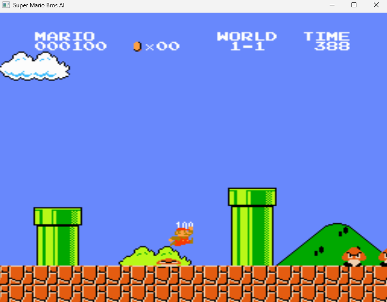

# Super Mario Bros AI

This project implements an AI agent that learns to play **Super Mario Bros** using **Reinforcement Learning (RL)**.  
The model is trained using the **PPO (Proximal Policy Optimization)** algorithm from **Stable-Baselines3**.

## 🚀 Project Structure

- `train_agent.py` — Sets up the environment, handles preprocessing, and trains the AI agent.
- `classes/saving.py` — A custom callback class to automatically save the model during training.
- `show.py` — Functions to visualize random gameplay or display the trained agent's performance.
- `mario_AI.py` — The main script to load and run the trained AI model.

## 🛠️ Technologies Used

- **Python 3.8.0**
- **Stable-Baselines3**
- **OpenAI Gym 0.23.1**
- **Gym-Super-Mario-Bros 7.3.0**
- **NES-Py 8.1.8**
- **Shimmy >=2.0**
- **OpenCV**

## ⚙️ Installation

Install the required packages using the following commands:

```bash
pip install gym-super-mario-bros==7.3.0
pip install nes-py==8.1.8
pip install gym==0.23.1
pip install stable-baselines3[extra]
pip install "shimmy>=2.0"
pip install opencv-python
```

> Make sure you are using **Python 3.8.0** for best compatibility.

## 🎮 How it Works

### 1. Environment Preprocessing

- Converts game frames to grayscale.
- Stacks four consecutive frames to provide temporal information.
- Uses `JoypadSpace` to limit Mario's actions to basic movements (left, right, jump).

### 2. Training

- The agent is trained using PPO with a CNN-based policy (`CnnPolicy`).
- A very low learning rate (`0.000001`) is used to ensure stable long-term learning.
- Models are saved automatically every 10,000 steps.

### 3. Visualization

- You can watch either random gameplay or have the trained agent play.
- OpenCV is used to resize and display the frames.

## 📷 Example Screenshots

### Training Process (Model Checkpoints)


### Gameplay (AI Playing Super Mario)


## 📝 Notes

- The environment used is **SuperMarioBros-v0**.
- Trained models are saved in the `/train/` directory.
- Logs for visualization (e.g., TensorBoard) are stored in the `/logs/` directory.

## 🙌 Acknowledgements

- [OpenAI Gym](https://github.com/openai/gym)
- [Stable-Baselines3](https://github.com/DLR-RM/stable-baselines3)
- [NES-Py](https://github.com/ntasfi/NESGym)
- [Gym-Super-Mario-Bros](https://github.com/Kautenja/gym-super-mario-bros)
